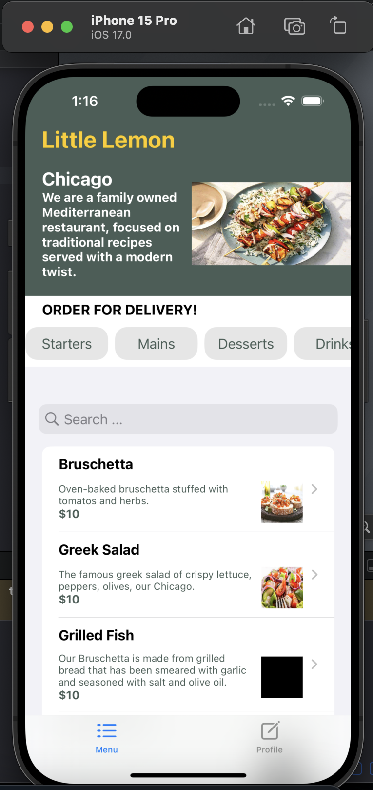
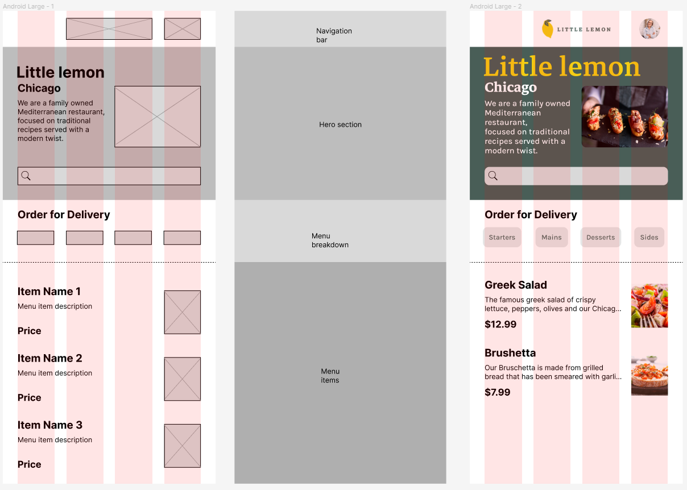

# META IOS capstone project
- The following repository contains the little lemon app for the IOS capstone course

## Screens
|  |
|:--:|
| *Home screen* |

- Onboarding screen where the user can input his information
- Home screen with a little text about the little lemon restaurant and a list of the dishes
- Dish details screen with the information about the dish
- Profile screen with the user information and a log out button

## Wireframe
- Wireframe made on figma
